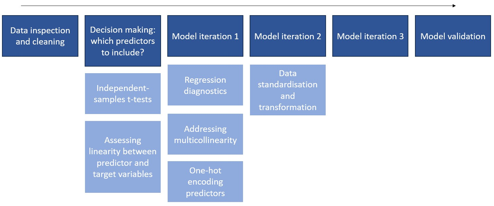
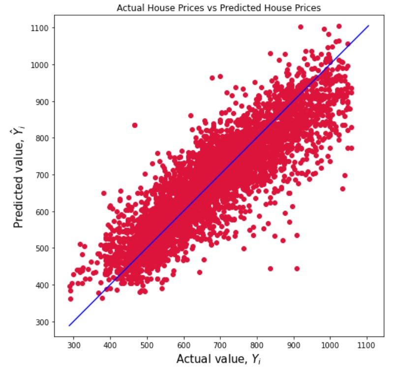
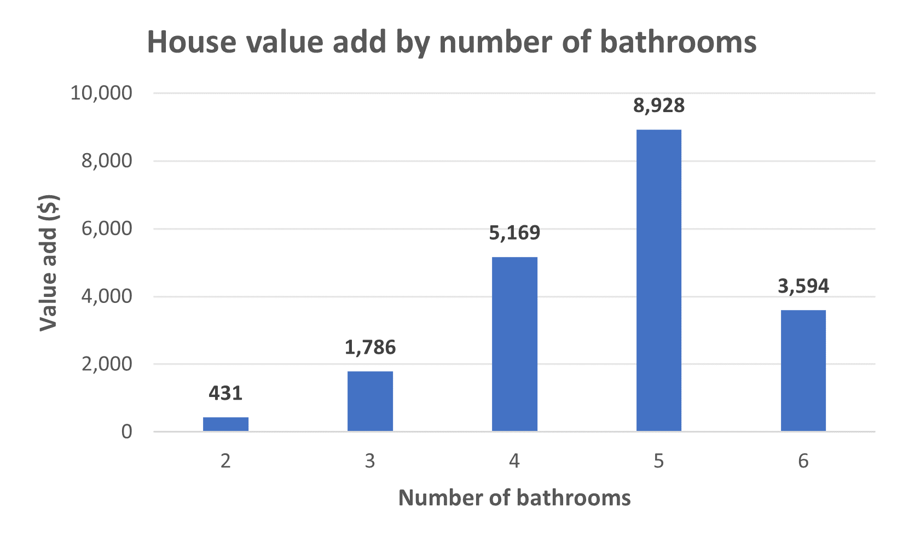
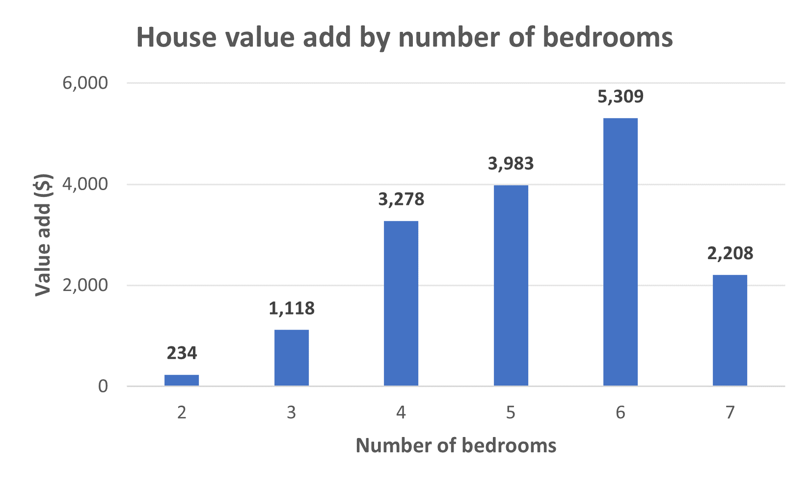
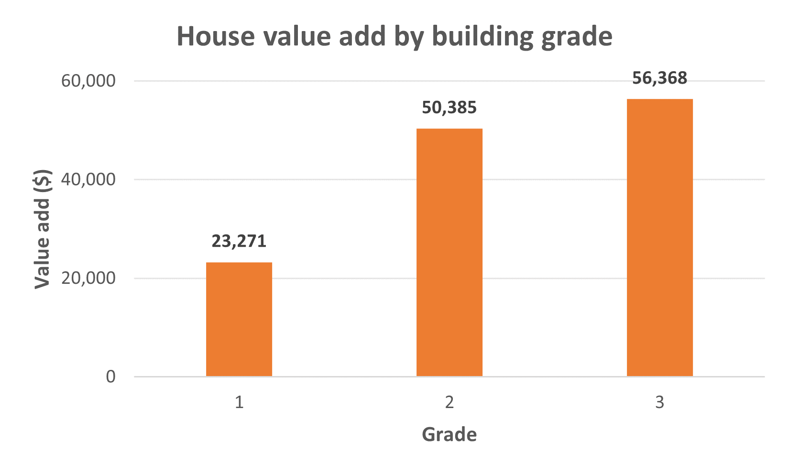
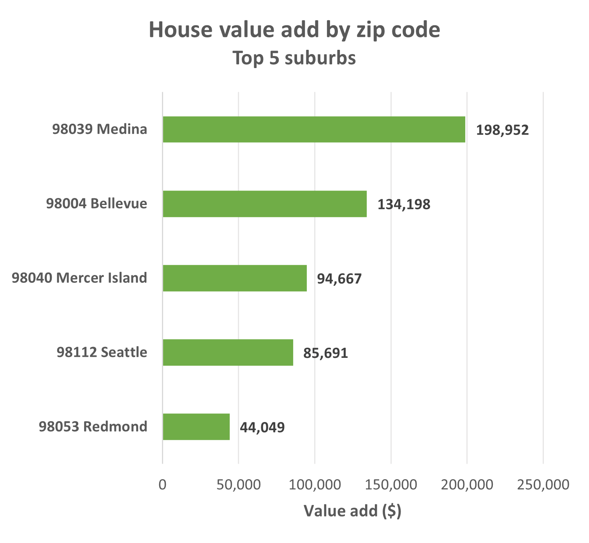

# House Price Prediction

**Author**: [Arina Ridha](https://www.linkedin.com/in/arina-ridha)

## Overview 

Multiple linear regression was utilised to predict prices of houses sold between the years 2014 - 2015 in King County, Washington State, USA. Through six predictors (Number of bedrooms, number of bathrooms, number of floors, basement size, building grade, and zipcode), the regression model accounted for ~76% of the variability in house prices. Model improvement suggestions are presented, both in the context of more advanced statistical modelling techniques, as well as further house and neighbourhood characteristics to be collected and analysed.

## Business problem

There are numerous factors to consider when attempting to sell a home (as if the competitive state of the real estate market wasn't stressful enough). While the consequences of underestimating your home's market value are obvious, overestimations would on the other hand hinder a lot's performance on the market. 

__[Independent home valuations](https://www.nsw.gov.au/housing-and-construction/property-acquisition/valuations-and-compensation/getting-your-property-valued#toc-getting-your-own-valuation
)__ are commonly used for sellers to assess their property's market value - although with every professional service, valuations do incur a fee. Banks and real estate agencies are increasingly offering __[free online appraisal tools](https://www.realestate.com.au/property/?campaignType=external&campaignChannel=sem&campaignSource=google&campaignName=track_property&campaignKeyword=generic_appraisal&gad=1&gclid=Cj0KCQjw06-oBhC6ARIsAGuzdw0iPECUhALTOHU1N5M5rihmsvDhWZUMvhSwRB6SIuEbcJWXgki0_d4aAq6jEALw_wcB)__, which are helpful in allowing sellers to have a more informed position prior to taking the next steps before formally listing their house on the market. 

Through multiple linear regression, the current project aims to replicate the functionality of commercial home appraisal tools by taking into account a number of readily-known factors (e.g., number of bedrooms and bathrooms, home zip code). The model is built on a dataset of houses sold between 2014 - 2015 in King County, Washington State, USA.

## Data sources

**King County House Data** (`kc_house_data.csv`) contains the following information from homes that were sold between 2014 - 2015:
* id: unique house identifier
* date: when the house was sold
* price: house sale price
* bedrooms: number of bedrooms
* bathrooms: number of bathrooms
* sqft_living: square footage of the house
* sqft_lot: square footage of the lot
* floors: number of floors in the house
* waterfront: whether the house has a waterfront view
* view: whether the house has been viewed
* condition: the overall condition (level of maintenance) of the house
* grade: the overall grade (level of improvements) of the house
* sqft_above: square footage of the house, excluding the basement
* sqft_basement: square footage of the basement
* zipcode: zip code, used by the United States Postal Service

## Process summary

## Methods

Please see [houseprice_predict.ipynb](https://github.com/arinargh/houseprice-prediction/blob/main/houseprice_predict.ipynb) for the full methodology.

## Results

The full model predicts **~76% of the variability in house prices** by taking into account the following predictors: 
* Number of bedrooms
* Number of bathrooms
* Number of floors
* Basement size
* Building grade
* Zip code

Three interesting (albeit maybe a little obvious) insights in particular:
> Note: Graphs are plotted using statistically significant correlation values only (i.e., p < alpha at 0.05)

1. **In general, the greater the number of bedrooms and bathrooms, the higher the selling price**, although the model coefficients may suggest points of diminishing returns. That's to say, knocking down walls to establish anything beyond 6 bedrooms and 5 bathrooms may not be the as worth the return on investment (However, it's also important to note that the sample sizes for houses featuring over 4 bathrooms or 6 bedrooms are very small, resulting in less reliable coefficient values). Bathrooms appear to add more value to a home than bedrooms, though it's likely more costly to install one, too.

2. **Higher building grades correlate with higher selling prices**. Getting your house appraised and achieving a minimum grade of 8 ("above average construction and design") may help your lot stand out from others in the market. Improving construction quality (e.g., better ventilation, more energy efficient fixtures) would be an easier and more accessible option, compared to building an entirely new room.

3. **Your zip code strongly informs your property price**. Vicinity to the central business district (e.g., 98105, 98112, 98199, which are all Seattle zip codes) and luxury living (e.g., 98039: Medina, 98040: Mercer Island, 98053: Redmond) are two factors that would account for this.

## Conclusion

This model isn't intended to completely determine the final sale price of a house; rather, it would hopefully be a helpful tool to help individuals garner a better idea of what their asking price may be, and how competitive their property would be relative to other lots on the market.

### Next steps

1. **More rigorous and advanced modelling techniques**, such as utilising factor analysis when selecting predictors, comparing performance across linear, ridge, and lasso regression models, and implementing k-fold cross-validation techniques for better model training and evaluation.

2. **More informative house parameters**. E.g., looking at the size of bedrooms and bathrooms instead of just the number of them. (If two houses were the same size, and house A featured 5 small bathrooms while house B featured 3 large ones, would house A go for a higher price?)

3. **More neighbourhood parameters**. It would be interesting to see how the distance of a home from  facilities (e.g., schools, public transport, grocery stores) may play into that home's value.
